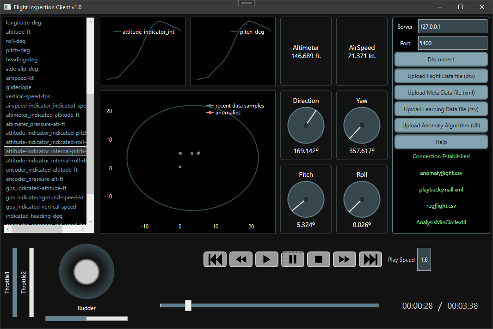

# 1. FlightGear Inspection Client v1.0



## Table of Contents
* [1. FlightGear Inspection Client v1.0](#1-flightgear-inspection-client-v10)
* [2. Introduction](#2-introduction)
* [2.1. This Version includes](#21-this-version-includes)
* [3. Dependencies](#3-dependencies)
* [4. User Guide](#4-user-guide)
  *  [4.1. Required Programs](#41-required-programs)
  * [4.2. Setup FlightGear](#42-setup-flightgear)
  * [4.3. Installation](#43-installation)
  * [4.4. How To Use](#44-how-to-use)
* [5. UML Diagrams](#5-uml-diagrams)
* [6. Contributors](#6-contributors)
* [7. Useful Links](#7-useful-links)

***

# 2. Introduction

This project provides a simple minimalistic GUI client that aids the user in analyzing and detecting anomalies in a flight. The flight can also be simulated using FlightGear alongside this program. The interface provides playback ability and several useful panels that make the data easier to analyze (e.g. graphs, dashboard, joystick).

## 2.1. This Version includes

***

* Communication with a FlightGear server to simulate a flight (given flight data in CSV form).

* A GUI client that allows the user to control the simulation using basic media control buttons (e.g. play, stop, fast-forward).

* A dynamic joystick that simulates the pilot's controls during playback (given flight data).

* Diffrent graphs that show the correlation relationship between different data features in the flight data file.
The graphs update automatically during playback.

* The user is able to provide a DLL with custom anomaly detection algorithm (according to a specific API). The program is able to load the DLL dynamically at runtime and show the user the anomalies.

***

# 3. Dependencies

In order to increase backward compatibility:

* The project uses the .NET 3.1.13 framework.
* The project is compiled to x86 architecture.

[Nuget package Oxyplot.Wpf 2.0.0](https://github.com/oxyplot/oxyplot) is required.

***

# 4. User Guide

## 4.1. Additional Programs

* [FlightGear Simulator](https://www.flightgear.org/download) (not required if simulation is not needed).
* Visual Studio 2019 (or newer) is very recommended when building the project.
   
## 4.2. Setup FlightGear
**This part is not mandatory. It's relevant to users who will simulate the flight.**
* Provide XML metadata file (with column titles for your data tables).
  * Put a copy of your metadata file in `{FLIGHTGEAR_INSTALLATION_FOLDER}/data/Protocol`.
  * For information on the contents of the metadata file: refer to the [wiki](https://wiki.flightgear.org/XML).

* Configure FlightGear as a UDP server.
  * Open FlightGear.
  * Go to settings.
  * Scroll down to additional settings.
  * Enter these commands (fill the `{TAG}` with your information):
    ```
    --generic=socket,in,10,{IP_ADDR},{PORT},udp,{METADATA_FILENAME} --fdm=null
    ```
  * For example, to create a UDP server on `localhost:5400` with `playback_small.xml` as your metadata file:
    ```
    --generic=socket,in,10,127.0.0.1,5400,udp,playback_small --fdm=null
    ```

## 4.3. Installation

### This section describes the installation process using Visual Studio 2019:

* Clone the project
  ```
  git clone https://github.com/yarin-da/adv_prog_2.git
  ```
* Open the file `Adv_Prog_2.sln` with Visual Studio.
* Build the project:
  * Go to **Build->Configuration Manager**.
    * Set **Configuration** to **Release**.
    * Set **Platform** to **x86**.
  * Click on **Build->Build Solution**.
* Run `Adv_Prog_2.exe` in `{PROJECT_FOLDER}/bin/x86/Release/netcoreapp3.1`.

## 4.4. How To Use

* Run the program (Run FlightGear too if you're interested in simulation).
* At the right side, there's the "Setup Panel". 
  * Use the help button for basic instructions.
  * There are labels that tell you if something is missing.
  * Use the buttons above them to upload everything into the program.
  * You can upload your own DLL with your own custom anomaly detection algorithms.
    * If you'd like to create your own DLL - refer to [DLL examples source code](https://github.com/yarin-da/adv_prog_2_dll).
  * Notice that to run the simulation you only need to connect to FlightGear and upload flight data. Although, Some of the panels may not function until you upload the rest of the data.
* Once you upload the metadata file (XML), you'd be able to choose features on the graphs at the left panel.
* At the bottom there are playback buttons that function just like regular media players.

***

# 5. UML Diagrams


The program's responsibilities are split by many classes that interact with eachother. The model class/interface is used as a facade for this whole process.

It's also implemented as a singleton, because all view models were designed to share data by using the same instance of the model class.


The project uses MVVM pattern to decouple the view from the model.
Each panel in the main window has its own view (xaml and xaml.cs).
Each view is connected to its own view model.
All view models share the same instance of the model class (because it's a singleton).

***

# 6. Contributors

* [Belo Coral](https://github.com/coralbelo)
* [Dado Yarin](https://github.com/yarin-da)
* [Katav Adi](https://github.com/AdiKatav)

***

# 7. Useful Links

* [Oxyplot Repository](https://github.com/oxyplot/oxyplot)
* [FlightGear Simulator Download Page](https://www.flightgear.org/download)
* [Flight Inspection Client (master branch)](https://github.com/yarin-da/adv_prog_2)
* [DLL examples source code](https://github.com/yarin-da/adv_prog_2_dll)
* [Program Demonstration Video](YOUTUBE_LINK)
   
***